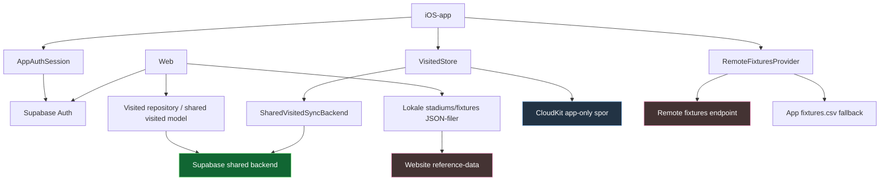

# Integration Status

## Formål
Dette dokument giver et samlet overblik over, hvordan Tribunetour hænger sammen på tværs af:
- iOS-app
- web
- auth
- reference-data
- brugerdata (`visited`)

Målet er at gøre det tydeligt:
- hvad der allerede er bygget sammen
- hvad der kun delvist hænger sammen
- hvad der stadig mangler, før løsningen kan betragtes som færdig

---

## Kort status

### Overordnet vurdering
Tribunetour er ikke længere to helt adskilte spor.

App og web deler nu:
- samme auth-retning
- en fælles retning for `visited`
- samme produktbegreber
- i praksis samme kampprogram-indhold

Men løsningen er stadig i en overgangsfase, fordi:
- reference-data ikke kommer fra én fælles pipeline endnu
- appens gamle lokale/CloudKit-model stadig lever for app-only spor
- ikke alle brugerdatafelter er fælles endnu

### Kort sagt
Status lige nu er:

`App og web hænger nu sammen på login og delt visited i praksis, men endnu ikke på én fuld fælles datamodel og én fælles reference-data-pipeline.`

---

## Grafik

### Sådan skal grafikken læses
- Appen har allerede et fælles auth-spor mod Supabase.
- Appen har også et shared visited-sync-spor mod backend.
- Web bruger shared visited-model.
- App og web er endnu ikke koblet på samme reference-data-loader.
- CloudKit lever stadig i appen for app-only data, men er ikke længere fælles sandhed for `visited`.

---

## Hvad der er bygget sammen

### 1. Fælles loginretning
App og web bruger nu samme overordnede auth-retning via Supabase.

Det betyder:
- web har login som reel produktfunktion
- app har login i selve produktet
- appen gemmer session lokalt
- appen kan bruge token til shared backend-kald

Centrale filer:
- `AppAuthClient.swift`
- `AppAuthSession.swift`
- `AppAuthConfiguration.swift`
- web: auth-flow i website-repoet

### 2. Shared visited-model findes
Der er nu en fælles retning for `visited`, som både app og web kan arbejde imod.

Det betyder:
- `clubId` er den vigtige bro mellem reference-data og brugerdata
- backend-kontrakten er beskrevet
- appen har klientkode til shared visited-backend
- web er bygget videre på shared visited-retningen
- tværflade-sync er nu verificeret i praksis mellem app og web

Centrale dokumenter:
- `VISITED_SHARED_MODEL.md`
- `VISITED_BACKEND_CONTRACT.md`
- `VISITED_MIGRATION_PLAN.md`

Centrale filer:
- `SharedVisitedSyncBackend.swift`
- `SharedVisitedSyncModels.swift`
- `HybridVisitedSyncBackend.swift`
- `AppVisitedBootstrapCoordinator.swift`

### 3. Første login i appen har bootstrap-retning
Appen er designet til, at første login ikke bare laver en blind merge med web-data.

I stedet er retningen:
- appens eksisterende besøgsdata er udgangspunktet
- shared backend bootstrap’es fra appen
- derefter kan fælles sync tage over

Det er vigtigt, fordi appen har været det mest modne produktspor.

### 4. Kampprogrammet er bragt på linje i indhold
Appens kampprogram og webens kampprogram er nu opdateret til samme dataindhold.

Det betyder:
- mismatch i faktiske kampe er løst
- web viser nu samme fixtures som appen

Men:
- det er stadig ikke én fælles teknisk pipeline
- web bruger stadig sin egen reference-datafil

---

## Hvad der kun delvist er bygget sammen

### 1. Reference-data
Reference-data er kun delvist samlet.

#### Det der virker
- appen kan bruge remote fixtures med lokal fallback
- web kan vise de samme fixtures som appen, når filerne holdes synkroniserede
- kontrakten for stabile IDs er dokumenteret

#### Det der ikke er helt færdigt
- app og web bruger ikke samme loader-lag
- web læser stadig lokale JSON-filer
- app bruger `RemoteFixturesProvider`
- der findes ikke én sand pipeline for opdatering af reference-data

Konsekvens:
- nye mismatch kan opstå igen, hvis data kun opdateres ét sted

### 2. Visited-sync i appen
Visited-sync fungerer nu i praksis på tværs af app og web, men arkitekturen bærer stadig præg af migration omkring app-only data.

#### Det der virker
- appen kan logge ind
- appen kan bruge shared backend
- appen kan bootstrap’e shared visited-state
- token-refresh fungerer nu
- app og web kan ændre `visited`, og ændringen forbliver stabil på tværs

#### Det der stadig er overgang
- runtime-modes er reduceret, men `CloudKit (legacy)` lever stadig som fallback/internt spor
- CloudKit er stadig en del af appens model for app-only data
- foto/review/plan er endnu ikke flyttet til fælles model

Konsekvens:
- `visited` er nu fælles i praksis, men resten af appens datamodel er ikke fuldt konsolideret

### 3. Brugerdata ud over `visited`
Appen har langt mere funktionalitet end web.

Appen har allerede:
- noter
- reviews
- billeder
- stats
- achievements
- planer/weekend-plan

Web har endnu ikke samme bredde.

Konsekvens:
- appen er stadig den egentlige primære produktflade
- web er endnu ikke feature-paritet, selv om retningen er fælles

---

## Hvad der mangler

### 1. Én fælles reference-data-pipeline
Dette er det vigtigste manglende stykke.

Det ønskede slutbillede er:
- ét fælles reference-dataformat
- én fælles opdateringspipeline
- app og web læser samme kilde eller samme genererede kontrakt

Når dette er på plads:
- kampprogrammet kan ikke så let drive fra hinanden igen
- app og web bliver mere forudsigelige at vedligeholde

### 2. Beslutning om endelig source of truth for visited
Lige nu er den låste retning:
- appen er kun primær i bootstrap-øjeblikket
- shared backend er autoritativ efter bootstrap

Det manglende slutskridt er at beslutte:
- hvornår CloudKit ikke længere er det primære visited-lag

### 3. Oprydning i migrationslag
Når den endelige retning er besluttet, bør disse ting strammes op:
- runtime-flags
- hybrid-/prepared modes
- midlertidige brugerbeskeder om overgang
- rå fejlmeddelelser i sync-flow

### 4. Tydelig afgrænsning mellem app-only og shared data
Den overordnede produktbeslutning er nu skrevet ned, men mangler senere implementering for de næste datatyper.

Det gælder især:
- billeder
- reviews
- noter
- plan/weekend-plan

---

## Elementstatus

| Element | Status | Bemærkning |
|---|---|---|
| Fælles auth-retning | Bygget | App og web bruger samme Supabase-retning |
| Login i app | Bygget | Session og token bruges i appen |
| Token refresh i app | Bygget | Udløbet JWT håndteres nu |
| Shared visited backend | Bygget | App kan tale med shared backend |
| Bootstrap fra app til shared | Bygget | Første login har særskilt bootstrap-retning |
| Web visited-model | Bygget | Web læser og skriver shared `visited` som produktmodel |
| Visited steady-state | Bygget | Shared backend er autoritativ efter bootstrap og verificeret i praksis |
| Reference-data-kontrakt | Bygget | IDs og regler er dokumenteret |
| Fælles reference-data-pipeline | Mangler | App og web læser ikke samme tekniske pipeline endnu |
| Kampprogram i indhold | Bygget | Web og app er i sync lige nu |
| Kampprogram i pipeline | Mangler | Sync er stadig manuelt/duplikeret |
| App/web feature-paritet | Mangler | Appen har stadig væsentligt mere funktionalitet |
| Shared vs app-only data matrix | Bygget | Produktgrænser er nu dokumenteret |

---

## Aktuel go/no-go

Den operative integrationscheckliste ligger nu i `RELEASE.md` under `Integration Release Checklist`.
Det er den liste, der bør bruges før næste integrationsrelease eller intern testomgang.

---

## Anbefalet slutplan

Hvis målet er at “gøre integrationen færdig”, er den mest realistiske rækkefølge:

### Fase 1
Færdiggør reference-data-sporet.

Mål:
- web og app skal ikke længere kunne ende med forskellige fixtures

### Fase 2
Lås visited-source-of-truth efter bootstrap.

Mål:
- shared backend bliver den normale fælles model
- CloudKit reduceres til overgangs- eller legacy-lag

### Fase 3
Ryd migrationslag og fejlkommunikation op.

Mål:
- produktet skal føles færdigt, ikke “forberedt”

### Fase 4
Beslut hvad web faktisk skal kunne på sigt.

Mål:
- undgå at web bliver et halvt spejl uden tydelig produktrolle

---

## Praktisk konklusion

Tribunetour er nået til et vigtigt punkt:
- Appen er det modne produkt.
- Web er ikke længere kun et sideprojekt.
- Auth og `visited` er begyndt at hænge sammen på tværs.

Det der mangler nu, er primært ikke flere app-features.

Det der mangler er:
- konsolidering
- fælles reference-data
- endelig beslutning om shared source of truth

Når de tre ting er lukket, vil app og web i praksis kunne betragtes som ét produkt med to flader.
