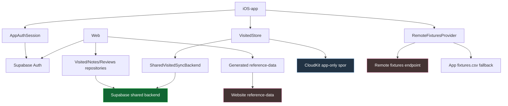

# Integration Status

## Formål
Dette dokument giver et samlet overblik over, hvordan Tribunetour hænger sammen på tværs af:
- iOS-app
- web
- auth
- reference-data
- brugerdata (`visited`, `notes`, `reviews`)

Målet er at gøre det tydeligt:
- hvad der allerede er bygget sammen
- hvad der kun delvist hænger sammen
- hvad der stadig mangler, før løsningen kan betragtes som færdig

---

## Kort status

### Overordnet vurdering
Tribunetour er ikke længere to helt adskilte spor.

App og web deler nu:
- samme auth-retning
- fælles modeller for `visited`, `notes` og `reviews`
- samme produktbegreber
- samme reference-data i praksis

Men løsningen er stadig i en overgangsfase, fordi:
- appens gamle lokale/CloudKit-model stadig lever for app-only spor
- ikke alle brugerdatafelter er fælles endnu
- fotos, weekend-plan og achievements endnu ikke er besluttet som fuld tværfladeoplevelse

### Kort sagt
Status lige nu er:

`App og web hænger nu sammen på login, reference-data, delt visited, delt notes og delte reviews i praksis, men endnu ikke på alle richer app-only dataspot.`

---

## Grafik

### Sådan skal grafikken læses
- Appen har allerede et fælles auth-spor mod Supabase.
- Appen har også et shared visited-sync-spor mod backend.
- Web bruger shared visited-, notes- og reviewmodeller.
- App og web er nu koblet på samme reference-data-kontrakt i drift.
- CloudKit lever stadig i appen for app-only data, men er ikke længere fælles sandhed for `visited`.

---

## Hvad der er bygget sammen

### 1. Fælles loginretning
App og web bruger nu samme overordnede auth-retning via Supabase.

Det betyder:
- web har login som reel produktfunktion
- app har login i selve produktet
- appen gemmer session lokalt
- appen kan bruge token til shared backend-kald

Centrale filer:
- `AppAuthClient.swift`
- `AppAuthSession.swift`
- `AppAuthConfiguration.swift`
- web: auth-flow i website-repoet

### 2. Shared visited-model findes
Der er nu en fælles retning for `visited`, som både app og web kan arbejde imod.

Det betyder:
- `clubId` er den vigtige bro mellem reference-data og brugerdata
- backend-kontrakten er beskrevet
- appen har klientkode til shared visited-backend
- web er bygget videre på shared visited-retningen
- tværflade-sync er nu verificeret i praksis mellem app og web

Centrale dokumenter:
- `VISITED_SHARED_MODEL.md`
- `VISITED_BACKEND_CONTRACT.md`
- `VISITED_MIGRATION_PLAN.md`

Centrale filer:
- `SharedVisitedSyncBackend.swift`
- `SharedVisitedSyncModels.swift`
- `HybridVisitedSyncBackend.swift`
- `AppVisitedBootstrapCoordinator.swift`

### 3. Første login i appen har bootstrap-retning
Appen er designet til, at første login ikke bare laver en blind merge med web-data.

I stedet er retningen:
- appens eksisterende besøgsdata er udgangspunktet
- shared backend bootstrap’es fra appen
- derefter kan fælles sync tage over

Det er vigtigt, fordi appen har været det mest modne produktspor.

### 4. Reference-data er bragt i drift på tværs
Appens kampprogram og webens kampprogram er nu koblet sammen via det fælles reference-data-flow.

Det betyder:
- mismatch i faktiske kampe er løst
- web viser nu samme fixtures som appen
- appen bruger nu remote fixtures-feed fra websitet som normal vej

### 5. Shared notes virker nu i praksis
`notes` er nu en reel tværflade-model.

Det betyder:
- notes kan læses og skrives fra både app og web
- notes er verificeret manuelt begge veje
- den kendte begrænsning er sync ved fokus/aktivering, ikke realtime

### 6. Shared reviews virker nu i praksis
`reviews` er nu også en reel tværflade-model.

Det betyder:
- samme reviewmodel bruges i app og web
- reviews kan læses og skrives fra både app og web
- reviews er verificeret manuelt begge veje
- den kendte begrænsning er sync ved fokus/aktivering, ikke realtime

---

## Hvad der kun delvist er bygget sammen

### 1. Visited-sync i appen
Visited-sync fungerer nu i praksis på tværs af app og web, men arkitekturen bærer stadig præg af migration omkring app-only data.

#### Det der virker
- appen kan logge ind
- appen kan bruge shared backend
- appen kan bootstrap’e shared visited-state
- token-refresh fungerer nu
- app og web kan ændre `visited`, og ændringen forbliver stabil på tværs

#### Det der stadig er overgang
- runtime-modes er reduceret, men `CloudKit (legacy)` lever stadig som fallback/internt spor
- CloudKit er stadig en del af appens model for app-only data
- foto/review/plan er endnu ikke flyttet til fælles model

Konsekvens:
- `visited` er nu fælles i praksis, men resten af appens datamodel er ikke fuldt konsolideret

### 3. Brugerdata ud over `visited`
Appen har langt mere funktionalitet end web.

Appen har allerede:
- noter
- reviews
- billeder
- stats
- achievements
- planer/weekend-plan

Web har nu delt `notes` og `reviews`, men endnu ikke samme bredde på resten.

Konsekvens:
- appen er stadig den egentlige primære produktflade
- web er endnu ikke feature-paritet, selv om kernebrugerdata nu er fælles
- fotos, weekend-plan og progression er de tydeligste resterende huller

---

## Hvad der mangler

### 1. Shared photos eller tydelig app-only beslutning
Hvis produktet skal føles helt rundt før release, er billeder det største resterende hul.

Det ønskede slutbillede er enten:
- shared foto-model mellem app og web

eller:
- helt tydelig produktbeslutning om at billeder er app-only i denne release

### 2. Weekend-plan som delt flow eller bevidst app-only scope
Plan/weekend-plan er stadig et separat app-spor.

Det ønskede slutbillede er enten:
- en lille shared plan-model

eller:
- at web ikke lover planfunktionalitet i denne release

### 3. Afledt eller delt progression/achievements
Achievements er stadig app-only.

Før en hel-integreret release bør vi beslutte:
- om web kun viser afledt progression fra shared data
- eller om achievements slet ikke er del af det fælles produktløfte endnu

### 4. Oprydning i migrationslag
Når den endelige retning er besluttet, bør disse ting strammes op:
- runtime-flags
- hybrid-/prepared modes
- midlertidige brugerbeskeder om overgang
- rå fejlmeddelelser i sync-flow

### 5. Tydelig afgrænsning mellem app-only og shared data
Den overordnede produktbeslutning er nu skrevet ned, men mangler senere implementering for de næste datatyper.

Det gælder især:
- billeder
- plan/weekend-plan
- achievements/progression

---

## Elementstatus

| Element | Status | Bemærkning |
|---|---|---|
| Fælles auth-retning | Bygget | App og web bruger samme Supabase-retning |
| Login i app | Bygget | Session og token bruges i appen |
| Token refresh i app | Bygget | Udløbet JWT håndteres nu |
| Shared visited backend | Bygget | App kan tale med shared backend |
| Bootstrap fra app til shared | Bygget | Første login har særskilt bootstrap-retning |
| Web visited-model | Bygget | Web læser og skriver shared `visited` som produktmodel |
| Visited steady-state | Bygget | Shared backend er autoritativ efter bootstrap og verificeret i praksis |
| Shared notes-model | Bygget | Kontrakt, SQL-runbook og shared backend er på plads |
| Notes på web | Bygget | Loggede brugere kan gemme noter på stadiondetaljen |
| Notes app/web sync | Bygget | Verificeret manuelt begge veje med kendt begrænsning: ikke realtime |
| Shared reviews-model | Bygget | Samme reviewmodel bruges i app og web |
| Reviews på web | Bygget | Loggede brugere kan gemme reviews på stadiondetaljen |
| Reviews app/web sync | Bygget | Verificeret manuelt begge veje med kendt begrænsning: ikke realtime |
| Reference-data-kontrakt | Bygget | IDs og regler er dokumenteret |
| Fælles reference-data-pipeline | Bygget | App og web er koblet på samme reference-dataflow i praksis |
| Kampprogram i indhold | Bygget | Web og app er i sync |
| Kampprogram i pipeline | Bygget | Remote fixtures-feed leveres fra webens genererede artefakt |
| App/web feature-paritet | Mangler | Appen har stadig væsentligt mere funktionalitet |
| Shared vs app-only data matrix | Bygget | Produktgrænser er nu dokumenteret |

---

## Aktuel go/no-go

Den operative integrationscheckliste ligger nu i `RELEASE.md` under `Integration Release Checklist`.
Det er den liste, der bør bruges før næste integrationsrelease eller intern testomgang.

---

## Anbefalet slutplan

Hvis målet er at “gøre integrationen færdig”, er den mest realistiske rækkefølge:

### Fase 1
Luk de resterende richer brugerdata-spor.

Mål:
- vælge og bygge de sidste dataområder, der er nødvendige for at produktet føles helt rundt

### Fase 2
Beslut og implementér billeder.

Mål:
- enten shared foto-model eller bevidst app-only release-scope

### Fase 3
Beslut og implementér weekend-plan/progression-scope.

Mål:
- web og app skal love det samme om `Min tur`, plan og progression

### Fase 4
Ryd migrationslag og release-copy op.

Mål:
- produktet skal føles færdigt, ikke “forberedt”

---

## Praktisk konklusion

Tribunetour er nået til et vigtigt punkt:
- auth, reference-data, `visited`, `notes` og `reviews` hænger nu sammen på tværs
- app og web opfører sig som ét produkt på kernebrugerdata

Det der mangler nu, hvis release-målet er “helt rundt”, er primært:
- billeder
- weekend-plan
- beslutning om progression/achievements på web

Når de tre ting er lukket eller bevidst afgrænset, kan app og web i praksis betragtes som ét produkt hele vejen rundt.
